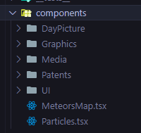
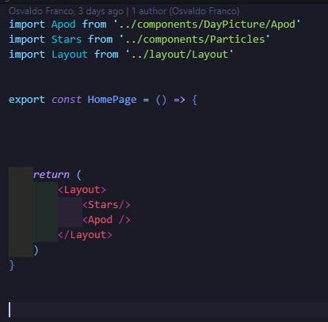
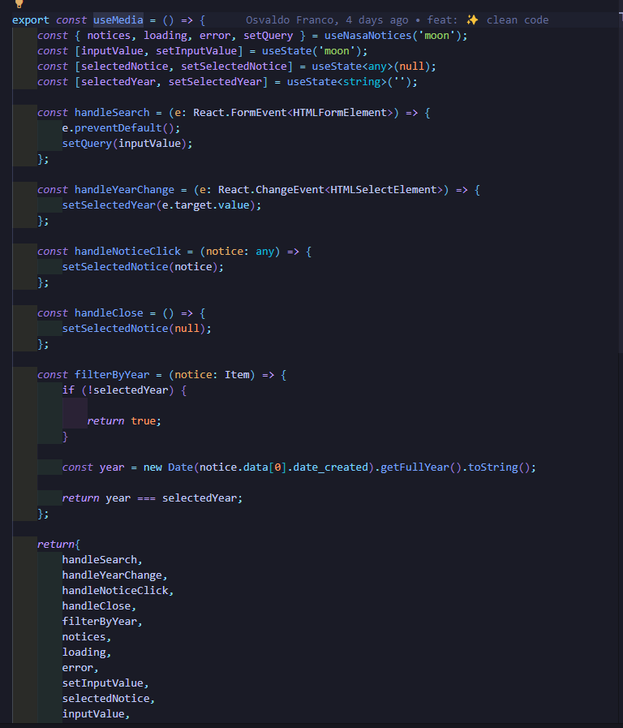
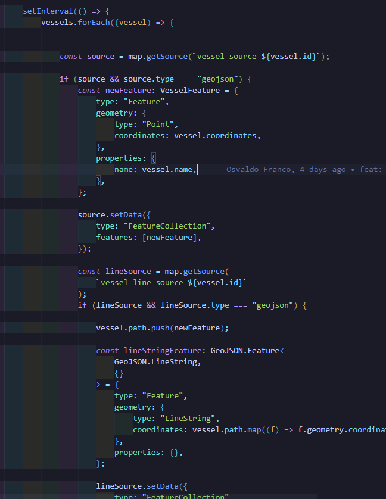
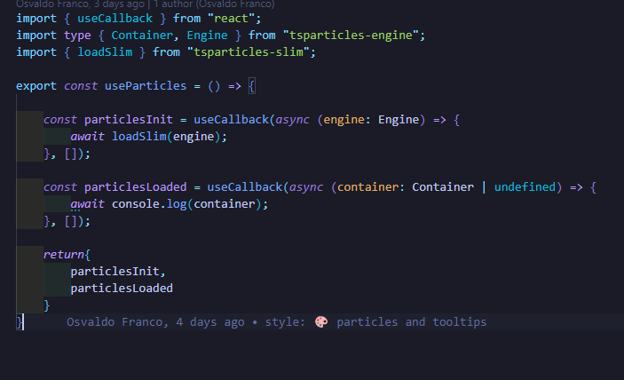

# Instrucciones sobre cómo configurar y ejecutar la aplicación.

1.- Necesitas instalar los modulos de node con el comando `npm install`, bajo la version node 18 o superior 

2.- crear el archivo `.env` en la raiz del proyecto con los siguientes datos

* Para obtener las apis keys, se tiene que ir a la api de la nasa y mapbox, registrarte para que se te proporcione una api key unica y personal [https://api.nasa.gov/] [https://www.mapbox.com/]

(en este caso se proporcionan las keys para facilitar el setup del proyecto)

`REACT_APP_NASA_API_KEY = zQYQLVKCzaLktITM6kPXNc7H5Gr2g7ppSZEsmwQ3` 

`REACT_APP_MAPBOX_KEY = pk.eyJ1IjoibG9nYW5jb2RlcyIsImEiOiJjbHgyamc0bGswbXlxMmlvYzZmaWl1MmR6In0.UAQ5BFTC__11XQmwpH-Qlg`

3.- ejecutar el comando `npm start` 

4.- abrir la aplicacion en [http://localhost:3000]

# Enfoque adoptado

### Tecnologias

* React 18
* Tailwind CSS
* Typescript
* API NASA
* Mapbox
* React Tooltip
* Recharts
* TS Particles

### Requisitos del proyecto: 
* Se indetifican los requisitos principales, que incluyen la obtención de datos de la API de la NASA y la presentacioón en una interfaz amigable y responsiva.

### Componentes de la aplicación: 
* Se dividen los compoentes en pequeños componentes reutilizables y especificos, esto facilita la gestion y mantenimiento del codigo

* Los componentes estan comunicados por medio de props, esto permite la transmision de datos y estados entre componentes padres e hijos

* Se implementando la carga dinamica de componentes con `React.lazy()` y `<Suspense>`, lo que mejora el rendimiento de la aplicación al cargar los componentes de forma diferida

* se utiliza `useState` y `useEffect` para manejar el estado y los efectos secundarios, como las solicitudes HTTP y los eventos del teclado

* Se utilizan clases de Tailwind CSS para el diseño de componentes.

## Suposición realizada y problemas conocidos

* El componente de grafica inicialemnete hacia peticiones cada segundo, causado por la solictud de filtrar por fecha los asteroides, se soluciono en su custom hook especificando las dependecias en `use Effect` 

* Se implemento un estado de carga y estados de error por si la obtencion de datos de la api llega a fallar

# Capturas de pantalla codigo

### Estructura codigo

Carpeta pages donde se guardaran todas las paginas del proyecto

Carpeta layout donde se guardara el navbar que sera utilizado en la mayoria de la aplicacion, 

Carpeta componentes donde se guardaran todos los componentes modularizados y reutilizables que se utiliziron a lo largo del desarrollo del proyecto

Carpetas contants, hooks, interfaces

# Componentes UI 

#### Componente UIButton

* Este componente se programo para ser reutilizado en diferentes secciones del codigo, recibiendo sus props segun se requieran

#### Componente UIErrorText

* Componente encargado de mostrar el error si los datos de la API fallan

#### Componente UIImg

* Componente encargado de renderizar imagenes en las diferentes secciones del codigo

#### Componente UIInput

* Componente con funcion de un input

#### Componente UIInputDate

* Componente con funcion de un input typo date, para ser usado en RangePicker de las graficas

#### Componente UIPagination

* Se encarga de paginar donde se solicite

#### Componente UIParagraph

* Este componente se encarga de mostrar subitulos, a su vez se le agrego una Prop boolean, ya que algunos datos recibidos de API contienen etiquetas HTML, por lo que segun sea el caso, se puede activar o desactivar dicha interpretación

#### Componente UISearchYear

* Muestra el rango de fechas por el cual se filtraran la Media 

#### Componente UISpinerLoading 

* Muestra un spiner en los que los datos estan siendo cargados 

#### Componente UITitle

* Este componente esta diseño para interpretar la etiqueta HTML que se le asigne, se uso para interpretar los headers de los titulos

#### Componente UIVideo

* Encargado de mostrar el source del video que se le asigne 

# Codigo Particles

* En este codigo se muestra la animacion de particulas de estrella en todas las paginas donde se mande llamar el componente

# Codigo Home

#### Codigo pages/home.tsx

se manda llamar sus respectivas importaciones, y se envuelven los componentes padres dentro del layout, Apod quiere decir `Astronomic Picture of the Day`, el componente `<Stars/>` es que que provee la animacion de particulas a lo largo de toda la aplicación

#### Este es el componente llamado Apod.tsx
* contine uso de estado loading, y error, para proporcionar un spiner de loding en lo que la data se carga, o el error en caso de que falle la carga

* Se esta utilizando un componente llamado `<UITitle>` para establecer el titulo a la pagina

* Suspense hace y lazy loading hace que la carga se difiera evitando la sobre carga de pedido de data
* Se pasan props al componente hijo

#### Componente hijo `<ApodDeatils>`

* En este componente se reutilizan los componentes creados previamente en `UI` que son los que se estaran reutilizando a lo largo de la aplicación, donde reciben los props del componente padre, que son los datos que vienen de la API

* Se provee `React.memo` para que react memorize el componente, asi evitando estar renderizado el componente cada vez que se visita la pagina, solo si algun dato de la props recibidas cambia estaria haciendo la peticion de renderizado de nuevo.

# Codigo Media

#### Componente padre `<Media>`

* En el componente se utilizan custom hook, haciendo el codigo mas legible y mantenible

* use Effect esta la escucha de que se monte el componente para poder cerrar el modal de los detalles con la tecla ESC

* Componente `UITitle` para el titulo de la pagina
* El componente `SearchForm` contiene la busqueda por palabras clave para que se muestren diferentes tipos de media como Marte, Jupiter, Tierra, Sol, etc... se tiene que proporcionar el texto en ingles 

* El componente `UISearchYear` filtra los datos de media segun su año

* Componentes `SpinerLoading` y `UIErrorText`, donde se muestra un spiner en lo que cargan los datos, o un error si la carga de datos falla

* Se agrega la paginacion de Media para no sobre cargar la seccion de datos

* El componente MediaDetails abre un modal donde se puede ver la descripcion de la carta seleccionada, junto con un video relacionado a la misma 

* Codigo padre dividido en componentes mas pequeños, se utiliza `<Suspense>` para diferir la carga del contenido evitando el sobre rendereo de la data

#### Codigo SearchForm

#### Codigo UISearchYear

#### Codigo NoticeCard

* Este componente es el encargado de mostrar las cartas con los datos disponibles en la pagina, se mete en un arreglo para recorrer toda la data proporcionada por la API de la NASA

#### Componente MediaDetails

* Este es el componente encargado de mostrar un modal junto con los datos proporcionados de la API asi como un video relacionado al mismo

# Codigo Patente

* Codigo de componente padre en la seccion Patens, de igual forma se usa Suspense para optimizar la carga de los datos 

* Se llama el componente `SpinerLoading` para mostrar un spiner en lo que los datos son cargados

#### Componente PatentSearch

* Este componente se encarga de filtrar los datos por palabra o numero de patente

#### Componte PatentList

* Componente encargado de mostrar todas las patentes proporcionadas por la API de la NASA 

* Componentes reutilizados con props

# Codigo MeteorsMap

* Componente que se encarga de mostrar los asteroides impactados en el planeta tierra

# Codigo Graphic

* Este el componente encargado de mostrar la grafica con el total de asteroides impactados por dia en el planeta tierra

* Muestra el error cuando el rango de fecha inicial y final supera los 7 dias establecidos por la API de la NASA 

* Tiene 3 componentes hijos, uno renderea un input de rango de fechas, asi como una grafica de Lineas y otra Barras

#### Codigo RangePicker

* Componente encargado de mostrar los asteroides por un rango de 7 dias 

#### Codigo LineGraphic

* Codigo que se encarga de mostrar la grafica de lineas mostrando asteroides impactados por dia en el planeta tierra

#### Codigo BarGraphic

* Codigo que se encarga de mostrar la grafica de barras mostrando asteroides impactados por dia en el planeta tierra

# Custom Hooks

#### customHook useGraphic

* Se encarga de pasar la fecha del sistema al input de endDate, a su vez le resta 7 dias para el input startDate, en el componente llamado `RangePicker`

* Almacena los datos de los asteroides obtenidos de la API de la  NASA

* Muestra el estado de la obtencion de datos, si falla muestra un mensaje de error, en este caso seria el mensaje de que el rango de 7 dias esta sobrepasado.

* El use Effect se ejecuta cada vez que cambian las fechas asignadas en los inputs

* Se calcula la diferencia de los 7 dias

* Se manda a la URL los parametros de las fechas para mostrar los asteroides segun la fecha especificada 

* Realiza la solicitud fetch para la obtencion de los datos

* Maneja la respuesta de los datos, los datos recibidos los parsea JSON creando un arreglo de objetos

* Actualiza el estado de `asteroidData` con los datos obtenidos

* Retorna los objetos de los estados para usarse en las graficas

#### customHook useApod

* Encargado de hacer la peticion a la url de la API

* Guarda los datos de la API en el gestor de estado

* Muestra el spiner de loading o el error 

#### customHook useMedia

* Custom hook encargado de mostrar las noticias, filtrar por año, buscar por palabra clave, formatear la fecha, y mostrar el modal, asi como cerrarlo

#### custom Hook useMeteors

* custom Hook encargado de proover la funcionalidad al componente

* La contante `vessels` se encarga de recorrer los datos de `METEORS_ENTRY` que se encuentran en la carpeta `constants/meteors.ts`

* El fragmento del codigo que esta use Effect se encarga de validar si `mapContainer.current` es una referencia valida a un elemento HTML

* Se crea la instancia del mapa de MapBox utilizando la clase `mapboxgl.Map`

* Carga estilos, zoom, y cordenadas del mapa en su estado inicial

* Esta seccion de codigo realiza varias operaciones relacionadas a la carga de estilos, configuracion de capas y fuentes de datos del mapa donde se muestran los asteroides

* Esta seccion de codigo usa `setInterval` para ejecutar la funcion asignada en un intervalo de tiempo especificado

* `vessels.forEach((vessel) => {}` itera sobre cada elemento proporcionado en el arreglo, que es una lista de objetos

* En general esta seccion de codigo obitene la fuente de datos asociada a vessel, verifica si la fuente de datos existe, crea objeto con la ubicacion de asteroides

* Este bloque de codigo retorna la funcion que se ejecutara cuando el componente se desmonte, asegurando que se limpien los recursos del mapa al eliminarlo

* Retorna `{mapContainer}` que es el encargado de pasarle toda la informacion al componente `MeteorsMap`

#### custom Hook useNasaNotices

* Se encarga de hacer la peticion a la API para despues pasarle la data a useMedia

* Este custom hook es hermano de useMedia que es el que se encarga de filtrar los datos por palabra clave en el input de buscar 

#### custom Hook usePagintation

* custom Hook encargado de la funcionalidad de la paginacion 

#### custom Hook useParticles

* este se encarga de pasar la funcionalidad al componente de las particulas 

#### custom Hook usePattent

* Almacena los datos de la API para patentes

* Maneja los estados de loading y filtro

* Maneja la respuesta de los datos obtenidos pasandolos  JSON y a su ves crea un arreglo de objetos `PatentData` para ser utilizados en el componente 

#### custom Hook useVideoNasa

* Se encarga de recorrer el arreglo de los videos sobre la media seleccionada, para mostrar el video en el modal 

# Tipado Typescript 

* Se pasa el tipado sobre las props recibidas en todos los componentes utilizados en la app react

* Se dividen dependiendo el componente para hacer mas legible el codigo y mantenible 

# Capturas de pantalla interfaz

## Home

#### Ingresando a Home

#### Datos Home Responsive

## Media

#### Ingresando a Media

#### Se cargan todos los recursos disponibles en Media 
Por defecto se carga la Media de la Luna

#### Paginacion para no sobre cargar la pagina de recursos 

#### Los recursos proporcionados ahora son filtrados por el campo de busqueda Mars (Marte) y el año (2019)

#### Al seleccionar una carta de Media se te abrira un modal con la descripción, un video relacionado, junto son sus Keywords, que a su vez las puedes utilizar en el campo de busqueda proporcionado

#### Responsive Media 

## Patents

#### Seccion Patentes NASA 

#### Filtro de Patentes
Se puede filtrar por numero o palabra de Patente

### Responsive Patentes

## Localización de asteroides impactados en el planeta Tierra
Se agrego una seccion donde se pueden localizar los asteroides impactados de la tierra, en un planeta donde puedes controlar el zoom y girar segun la localidad del planeta que sea de tu interes 

## Graficas asteroides impactados en el planeta Tierra

Grafica donde se muestran los asteroides impactados por fecha, la api proporcionada por la nasa solo deja buscar en un rango de 7 dias los asteroides, en caso de pasar ese rango se muestra un mensaje explicando el margen 

#### Mensaje de margen de busqueda

### Segunda grafica mostrando el numero de asteroides impactados por dia en la tierra

